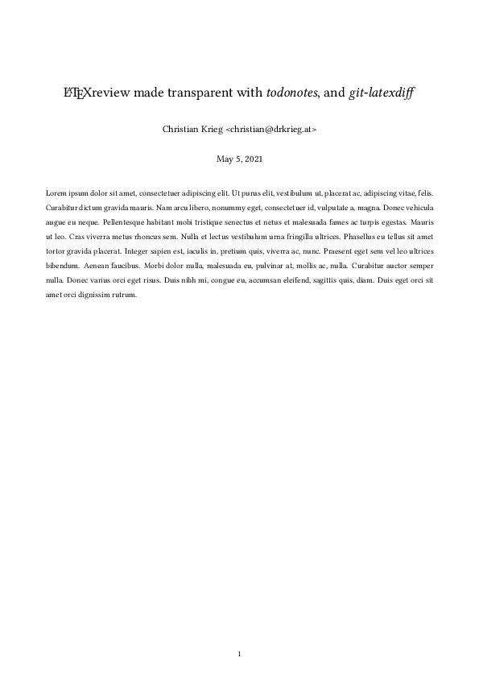
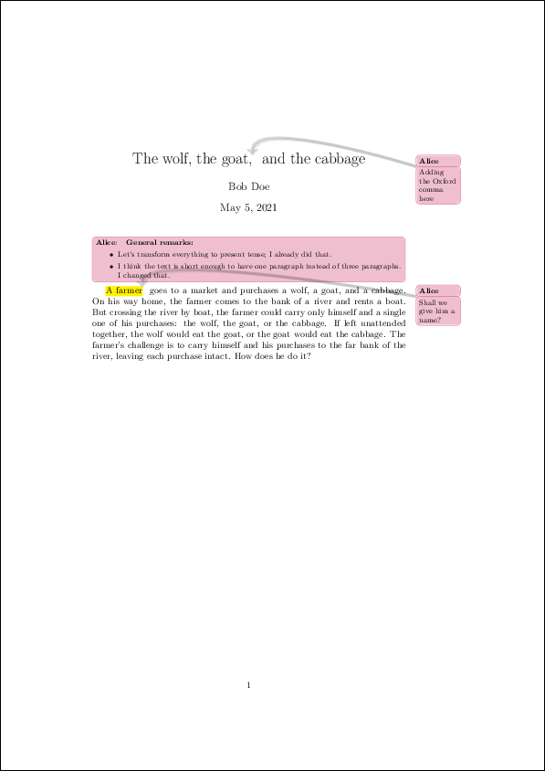
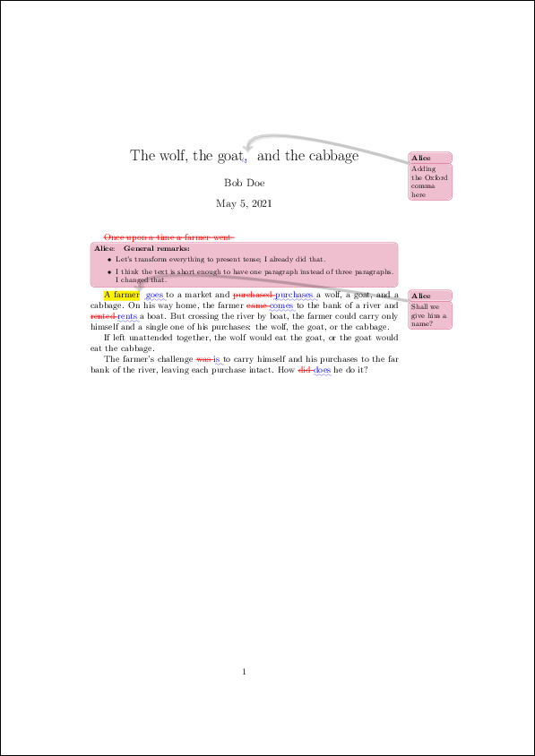
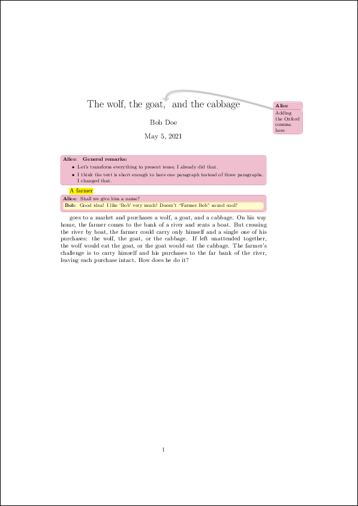

LaTeXreview
===============================================================================

This project provides utilities and a workflow to make reviews of LaTeX
documents straight-forward, transparent, and reproducible.

Overview
-------------------------------------------------------------------------------

Installation
-------------------------------------------------------------------------------

Usage
-------------------------------------------------------------------------------

Bob's challenge is to write down the wolf, goat, and cabbage problem. He creates
a file ``main.tex`` with all the essential meta-information (title and author),
and drafts a first version to describe the problem (literally copied from
`Wikipeda <https://en.wikipedia.org/wiki/Wolf,_goat_and_cabbage_problem>`__)::

   \documentclass[a4paper,twoside] {article}
   \title{The wolf, the goat and the cabbage }
   \author{Bob Doe}
   
   \usepackage{newtodo}
   \newtodo{alice}{purple}
   \newtodo{bob}{yellow}
   
   \begin{document}
   \maketitle
   
   Once upon a time a farmer went to a market and purchased a wolf, a goat, and
   a cabbage. On his way home, the farmer came to the bank of a river and rented
   a boat. But crossing the river by boat, the farmer could carry only himself
   and a single one of his purchases: the wolf, the goat, or the cabbage.
   
   If left unattended together, the wolf would eat the goat, or the goat would
   eat the cabbage.
   
   The farmer's challenge was to carry himself and his purchases to the far bank
   of the river, leaving each purchase intact. How did he do it?
   \end{document}

Bob builds his document using ``make``::

   make pdf

The result looks like this:

Bob creates a git repository, adds his file ``main.tex``, and commits his
changes::

   git init
   git add main.tex
   git commit -m "Added original draft of 'test' document"

In addition, Bob tags the original draft::

   git tag -a -m "Orginal draft of 'main' document" orig-draft

Bob then pushes the repository to a remote place where Alice has access to it.

Now, Alice adds some review comments. She decides it would be more appropriate
to tell the story in present tense, and modifies the text accordingly. Also, she
thinks it would be enough to have one paragraph for this fair amount of text.
Besides other comments, she adds a comment at the top of the text, listing her
general remarks for the text::

   \documentclass[a4paper,twoside] {article}
   \title{The wolf, the goat,\alice{Adding the Oxford comma here} and the cabbage}
   \author{Bob Doe}
   
   \usepackage{newtodo}
   \newtodo{alice}{purple}
   \newtodo{bob}{yellow}
   
   \begin{document}
   \maketitle
   
   \alice[inline]{ \textbf{General remarks:}
       \begin{itemize}
           \item{Let's transform everything to present tense; I already did that.}
           \item{I think the text is short enough to have one paragraph instead of
               three paragraphs. I changed that.}
       \end{itemize}
   }
   
   \alicehl{A farmer}{Shall we give him a name?} goes to a market and purchases a
   wolf, a goat, and a cabbage. On his way home, the farmer comes to the bank of a
   river and rents a boat. But crossing the river by boat, the farmer could carry
   only himself and a single one of his purchases: the wolf, the goat, or the
   cabbage.
   %
   If left unattended together, the wolf would eat the goat, or the goat would eat
   the cabbage.
   %
   The farmer's challenge is to carry himself and his purchases to the far bank of
   the river, leaving each purchase intact. How does he do it?
   \end{document}

Alice has a look at the reviewed document by calling ``make``:: 

   make pdf

The result is:

Alice can see her comments, but she does not see the changes she made on the fly
in order to transform the text from past tense to present tense. Therefore,
Alice calls ``make`` again to generate a PDF that shows the differences she made
while editing Bob's text::

   make diff

The result is:

Alice commits her changes into a new branch, tags the commit, and pushes the new
branch to the remote repository::

   git checkout -b alice-review1_2021-05
   git commit -m "Added review comments" main.tex
   git tag -a -m "Review 1 by Alice of orginal draft of 'main' document" review-alice1
   git push origin alice-review1
   git push --tags

Bob pulls the repository, looks at the reviewed document, and replies to one of
Alice's comments. He thinks that *Bob* would be a very good name for the farmer,
so he suggests that in a review comment::

   \documentclass[a4paper,twoside] {article}
   \title{The wolf, the goat,\alice{Adding the Oxford comma here} and the cabbage}
   \author{Bob Doe}
   
   \usepackage{newtodo}
   \newtodo{alice}{purple}
   \newtodo{bob}{yellow}
   
   \begin{document}
   \maketitle
   
   \alice[inline]{ \textbf{General remarks:}
       \begin{itemize}
           \item{Let's transform everything to present tense; I already did that.}
           \item{I think the text is short enough to have one paragraph instead of
               three paragraphs. I changed that.}
       \end{itemize}
   }
   
   \alicehl[inline]{A farmer}{Shall we give him a name?
       \bob[inline]{Good idea! I like `Bob' very much! Doesn't ``Farmer Bob'' sound
           cool?
       }
   }
   goes to a market and
   purchases a wolf, a goat, and a cabbage. On his way home, the farmer comes to
   the bank of a river and rents a boat. But crossing the river by boat, the farmer
   could carry only himself and a single one of his purchases: the wolf, the goat,
   or the cabbage.
   %
   If left unattended together, the wolf would eat the goat, or the goat would eat
   the cabbage.
   %
   The farmer's challenge is to carry himself and his purchases to the far bank of
   the river, leaving each purchase intact. How does he do it?
   \end{document}

Bob now reviews his changes that have happened since Alice's review::

   make diff

This results in the following PDF:

