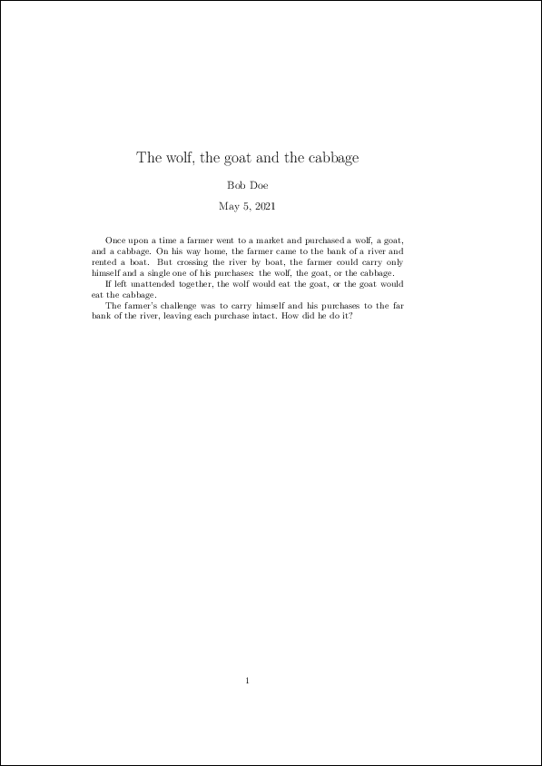

LaTeXreview
===============================================================================

This project provides utilities and a workflow to make reviews of LaTeX
documents straight-forward, transparent, and reproducible.

Overview
-------------------------------------------------------------------------------

Installation
-------------------------------------------------------------------------------

Usage
-------------------------------------------------------------------------------

We commit our changes::

    git commit -m "Added original draft of 'test' document"

We tag the original draft::

    git tag -a -m "Orginal draft of 'test' document" orig-draft

Now, lets have a look at the resulting PDF file::

    make pdf

The resulting PDF file looks like this:

