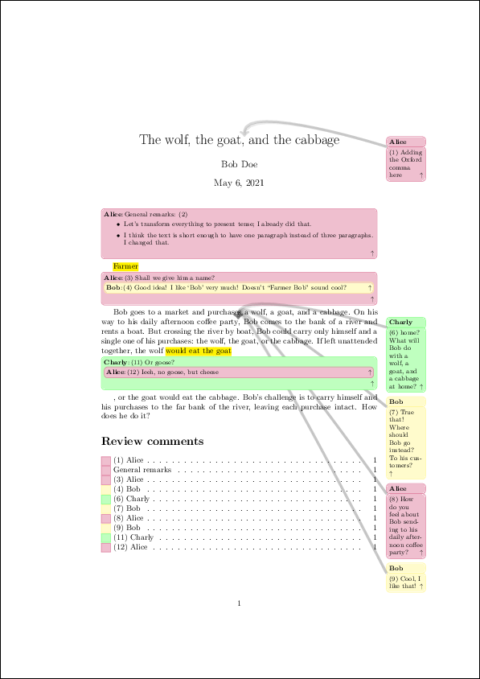
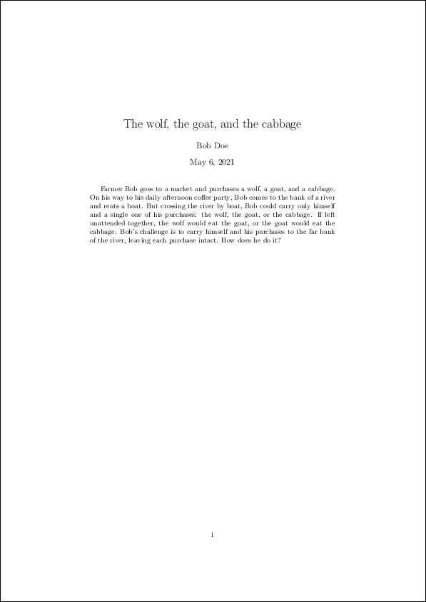
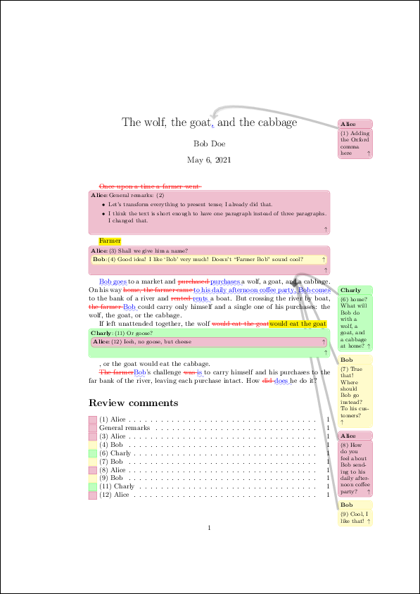
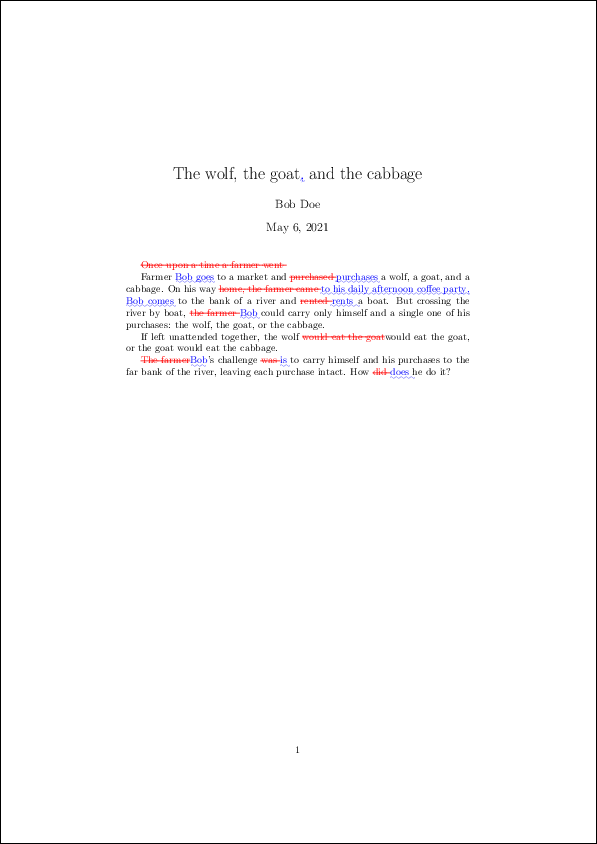

LaTeXreview
===============================================================================

This project provides utilities and a workflow to make reviews of LaTeX
documents straight-forward, transparent, and reproducible.

Usage example
-------------------------------------------------------------------------------

The following example given in :numref:`lst#mwe-complete` briefly demonstrates
the common use case of `LaTeXreview`:

.. code-block:: tex
   :linenos:
   :caption: Minimal working example to demonstrate the power of LaTeXreview
   :name: lst#mwe-complete

   \documentclass[a4paper] {article}
   \title{The wolf, the goat,\alice[]{Adding the Oxford comma here} and the cabbage}
   \author{Bob Doe}
   
   %\usepackage[disable]{review}
   \usepackage[]{review}
   \usepackage[hidelinks]{hyperref}
   \reviewer[]{alice}{purple}
   %\reviewer[disable]{bob}{yellow}
   \reviewer[]{bob}{yellow}
   \reviewer[]{charly}{green}
   
   \begin{document}
   \maketitle
   
   \alice[inline, caption={General remarks}, prepend]{
       \begin{itemize}
           \item{Let's transform everything to present tense; I already did that.}
           \item{I think the text is short enough to have one paragraph instead of
               three paragraphs. I changed that.}
       \end{itemize}
   }
   
   \alicehl[inline]{Farmer}{Shall we give him a name?
       \bob[inline]{Good idea! I like `Bob' very much! Doesn't ``Farmer Bob'' sound
           cool?
   %        \alice[inline, disable]{I like that! Let's do so!}
           \alice[inline]{I like that! Let's do so!}
       }
   }
   Bob goes to a market and
   purchases a wolf, a goat, and a cabbage. On his way to his daily afternoon
   coffee party\charly{home? What will Bob
   do with a wolf, a goat, and a cabbage at home?}\bob[]{True that! Where
   should Bob go instead? To his customers?}\alice{How do you feel about Bob
   sending to his daily afternoon coffee party?}\bob{Cool, I like
   that!}\charly[disable]{lol, +1}, Bob comes to
   the bank of a river and rents a boat. But crossing the river by boat, Bob
   could carry only himself and a single one of his purchases: the wolf, the goat,
   or the cabbage.
   %
   If left unattended together, the wolf \charlyhl[inline]{would eat the goat}{Or
   goose?\alice[inline]{Ieeh, no goose, but cheese}}, or the goat would eat
   the cabbage.
   %
   Bob's challenge is to carry himself and his purchases to the far bank of
   the river, leaving each purchase intact. How does he do it?
   
   \listoftodos[Review comments]
   \end{document}

Create PDF (including comments)::

   make pdf

When we disable all review comments in :numref:`lst#mwe-complete` as given in
:numref:`lst#disable-all`:

.. code-block:: tex
   :linenos:
   :caption: Disable all review comments
   :name: lst#disable-all

   [...]
   \usepackage[disable]{review}
   [...]

...and create the PDF again::

   make pdf

The result looks like this:

We can see the differences between the current working tree, and the original
draft::

   make diff COMMIT=orig-draft

Either with review comments included:

Or without review comments included:

